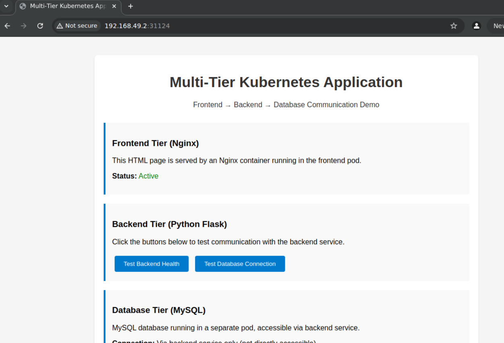

# Kubernetes Multi-Tier Application Deployment

A practical demonstration of deploying a classic three-tier web application (Frontend, Backend, Database) on a **Minikube** Kubernetes cluster. This project leverages key Kubernetes concepts for robust, scalable, and manageable application deployments, serving as an excellent portfolio piece to showcase your cloud-native skills.

---

## 🚀 Architecture Overview

This project deploys a classic three-tier application structure:

* **Frontend Tier (Nginx):** Serves static web content (HTML, CSS, JS) and acts as a reverse proxy for API requests, routing them seamlessly to the backend.
* **Backend Tier (Python Flask):** Implements the application's core business logic, exposing a RESTful API. It connects to the database tier to fetch or store data.
* **Database Tier (MySQL):** A relational database used to persist application data.

All tiers are deployed as separate microservices within a dedicated Kubernetes Namespace, communicating via Kubernetes Services.

### Project Structure

The Kubernetes manifests are organized into logical directories for clarity and ease of management, reflecting common practices for larger projects:

```
├── README.md
├── manifests/
│   ├── namespace.yaml
│   ├── backend/
│   │   ├── backend-config.yaml
│   │   ├── backend-deployment.yaml
│   │   └── backend-service.yaml
│   ├── database/
│   │   ├── database-config.yaml
│   │   ├── database-deployment.yaml
│   │   └── database-service.yaml
│   └── frontend/
│       ├── frontend-config.yaml
│       ├── frontend-deployment.yaml
│       ├── frontend-html-config.yaml
│       ├── frontend-service.yaml
│       └── nginx-config.yaml
```


## ✨ Key Kubernetes Concepts Demonstrated

This project showcases the practical application of:

* **Namespaces:** For logical isolation and organization of resources within the Minikube cluster.
* **ConfigMaps:** To externalize non-sensitive configuration data (e.g., database host, port, app title, Nginx configuration, HTML content).
* **Secrets:** To securely manage sensitive information (e.g., database passwords) for runtime injection.
* **Deployments:** To manage the desired state, scaling, and self-healing of application Pods, ensuring high availability.
* **Services (ClusterIP & NodePort):**
    * **`ClusterIP`:** For stable internal communication between tiers (e.g., Backend to Database, Frontend to Backend). Not externally accessible.
    * **`NodePort`:** To expose the Frontend application externally for user access via a specific port on the Minikube node.
* **Probes (Liveness & Readiness):** For robust health checking and ensuring service availability (demonstrated on the Backend application).
* **Volume Mounts (ConfigMap as Volume):** Mounting ConfigMaps as files within containers (e.g., Nginx configuration and HTML content), allowing for dynamic updates without rebuilding images.
* **Environment Variables from ConfigMaps/Secrets:** Injecting configuration directly into application containers, keeping application code clean and configurable.
* **Basic Scaling:** Demonstrating how to horizontally scale deployments for increased capacity.

---

## 💡 Design Choices & Lab Specifics

In a full production setup, applications are typically packaged into custom Docker images, and separate configuration files might be used. For the purpose of this lab and demonstrating direct Kubernetes YAML capabilities, certain simplifications were made:

* **In-line Application Code (Backend):** The Python Flask application code for the backend is directly embedded within the `backend-deployment.yaml` as part of the container's `command` and `args`. This avoids the need for a separate `Dockerfile` and custom image build, streamlining the lab experience. In a real project, you would build a dedicated Docker image for your application and reference it from a container registry.
* **HTML & Nginx Configuration via ConfigMaps (Frontend):** The static HTML content (`index.html`) and the Nginx server configuration (`default.conf`) are stored within Kubernetes `ConfigMaps` (`frontend-html-config.yaml` and `nginx-config.yaml`). These ConfigMaps are then mounted as files inside the Nginx container. This showcases ConfigMap mounting capabilities and allows for content updates without rebuilding the Nginx Docker image. In other scenarios, static assets might be served from a CDN or baked directly into a custom Nginx image.

---

## (Prerequisites)

Before you begin, ensure you have the following installed on your local machine:

* **Docker:** (Optional, but often used as Minikube's driver and for understanding container images).
* **Minikube:** A tool that runs a single-node Kubernetes cluster locally, perfect for development and testing.
    * [Minikube Installation Guide](https://minikube.sigs.k8s.io/docs/start/)
* **kubectl:** The Kubernetes command-line tool, used to interact with your Minikube cluster.
    * [kubectl Installation Guide](https://kubernetes.io/docs/tasks/tools/install-kubectl/)

---

## 🚀 Deployment Steps

Follow these steps to deploy the multi-tier application to your **Minikube** cluster:

1.  **Start Your Minikube Cluster:**
    Open your terminal and start Minikube. This will provision a local Kubernetes environment.

    ```bash
    minikube start
    ```

    Verify that your cluster is running and `kubectl` is configured correctly:

    ```bash
    kubectl get nodes
    ```

2.  **Clone the Repository:**
    Navigate to your desired directory and clone this project from GitHub.

    ```bash
    git clone https://github.com/Salman-Qurayshi/k8s-multi-tier-app.git
    cd k8s-multi-tier-app
    ```

3.  **Create Kubernetes Namespace:**
    A Namespace provides a mechanism for scoping resources within a cluster. We'll deploy all our application components into the `multi-tier-app` namespace.

    * **Option A: Using the YAML Manifest (Recommended for this project)**
        This project includes a `namespace.yaml` file for defining the namespace declaratively.

        ```bash
        kubectl apply -f manifests/namespace.yaml
        kubectl config set-context --current --namespace=multi-tier-app # Set current context to this namespace
        kubectl get namespaces
        ```

    * **Option B: Using the Command Line (Alternative)**
        You could also create the namespace directly via the `kubectl` command:

        ```bash
        kubectl create namespace multi-tier-app
        kubectl config set-context --current --namespace=multi-tier-app
        kubectl get namespaces
        ```

4.  **Deploy Database Tier:**
    This tier consists of a MySQL database. It requires a `ConfigMap` for non-sensitive settings and a `Secret` for credentials, a `Deployment` for the MySQL Pod, and a `ClusterIP Service` for internal communication.

    * **Create the Database Secret:**
      *   **Important Note on Secrets:** In a professional environment, sensitive data like database passwords are NEVER committed directly to Git, even in base64 encoded YAML. Instead, they are managed by dedicated secret management solutions (e.g., HashiCorp Vault, cloud provider secret managers like AWS Secrets Manager, or Kubernetes Secrets operators that pull from external sources).
        For this lab setup, we are creating the secret directly via the command line for simplicity and to avoid exposing credentials in the repository. These credentials are intentionally set to simple, easy-to-remember values for the lab, but **do not use them in production!**


    

        ```bash
        kubectl create secret generic database-secret \
          --from-literal=MYSQL_ROOT_PASSWORD=rootpassword123 \
          --from-literal=MYSQL_PASSWORD=userpassword123 \
          --namespace=multi-tier-app # Ensure it's created in the correct namespace
        ```

    * **Apply all other Database Manifests:**

        ```bash
        kubectl apply -f manifests/database/
        ```

6.  **Deploy Backend Tier:**
    This tier runs the Python Flask application. It uses a `ConfigMap` for application configuration and references the database Secret. It's managed by a `Deployment` and exposed via a `ClusterIP Service`.

    ```bash
    kubectl apply -f manifests/backend/
    ```

7.  **Deploy Frontend Tier:**
    This tier serves the Nginx web server. It utilizes `ConfigMaps` for Nginx configuration and static HTML content. It's managed by a `Deployment` and exposed externally via a `NodePort Service`.

    ```bash
    kubectl apply -f manifests/frontend/
    ```

8.  **Verify All Components:**
    Ensure all Kubernetes resources are running and in a ready state within your `multi-tier-app` namespace.

    ```bash
    kubectl get deployments -n multi-tier-app
    kubectl get pods -n multi-tier-app
    kubectl get services -n multi-tier-app
    kubectl get configmaps -n multi-tier-app
    kubectl get secrets -n multi-tier-app
    ```

---

## ✅ Accessing the Application

Once all components are confirmed to be running, you can access the frontend application through your **Minikube** cluster's IP address and the exposed NodePort.

1.  **Get Minikube IP and Frontend NodePort:**

    ```bash
    NODE_IP=$(minikube ip)
    FRONTEND_PORT=$(kubectl get service frontend-service -n multi-tier-app -o jsonpath='{.spec.ports[0].nodePort}')

    echo "Application URL: http://$NODE_IP:$FRONTEND_PORT"
    echo "Backend Health Check: http://$NODE_IP:$FRONTEND_PORT/api/health"
    echo "Backend Data Endpoint: http://$NODE_IP:$FRONTEND_PORT/api/data"
    ```
    Copy the `Application URL` and paste it into your web browser. You should see the frontend HTML page. Use the buttons on the page to test the backend and database connectivity.


## 📸 Live Demo & Screenshots


### Application Frontend

A screenshot of web browser displaying the main frontend application page, showing its successful loading and presentation.



### Backend Health Check

A screenshot of the browser showing the JSON output from the `/api/health` endpoint (e.g., `http://<Minikube-IP>:<NodePort>/api/health`), confirming the backend service is responsive.


### Database Connection Check

A screenshot of the browser showing the JSON output from the `/api/data` endpoint (e.g., `http://<Minikube-IP>:<NodePort>/api/data`), demonstrating successful connectivity between the backend and the database, often including the database version.


### Command Line Interface (CLI) Overview

A screenshot of the terminal showing the output of the minikube's urls


---


## 📈 Scaling the Application

Kubernetes Deployments make horizontal scaling straightforward. You can easily adjust the number of replicas for your backend and frontend tiers to handle varying loads:

```bash
# Scale frontend to 5 replicas
kubectl scale deployment frontend-deployment -n multi-tier-app --replicas=5

# Scale backend to 3 replicas
kubectl scale deployment backend-deployment -n multi-tier-app --replicas=3

# Verify new replicas
kubectl get deployments -n multi-tier-app
kubectl get pods -n multi-tier-app

# Scale back to original numbers for the lab
kubectl scale deployment frontend-deployment -n multi-tier-app --replicas=3
kubectl scale deployment backend-deployment -n multi-tier-app --replicas=2
```

## 📚 Learnings

This lab provided hands-on experience with:

- Designing and deploying a multi-tier application on Kubernetes.
- Leveraging Kubernetes objects like Deployments, Services, ConfigMaps, and Secrets.
- Understanding inter-service communication and exposure methods.
- Implementing basic health checks (Liveness and Readiness Probes).
- Performing basic scaling operations.
